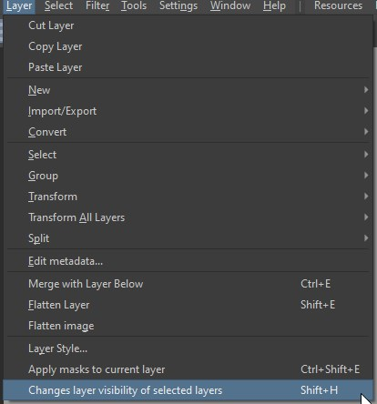
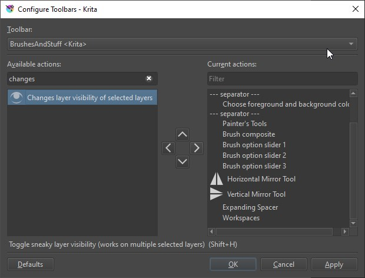
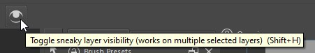

# Sneaky Visibility
A krita plugin to change layer visibility without adding it to the undo stack. It also works for multiple layers at once.  

## Installation
Download the zip from github (press the code button> download zip, or click the tags in release and download the zip from there), open krita then go to:  
Tools>scripts>import plugin from file  
Click ok and close and open krita.  

Or follow the manual installation:  

1- Copy the contents of the plugin folder into the pykrita folder in the krita resource folder (accessible through settings>manage resources>open resource folder).  
The folder label-box need to be completely moved (moving just the files inside will not work).  
2- Copy the file inside actions folder to the action folder in the krita resource folder. (if it doesn't exist, you can create a new folder called actions and add the file inside it)  
3- Open krita, go to settings>configure krita> python plugin manager. Locate the Label Box and check it.  
4- Restart krita. It should appear in the layer docker.  

## How to use
> Warning!
> This plugin doesnt change the action of the visibility icon on the layer docker (beside each layer).
> If you use that the layer will continue to be added to the undo stack

You have 3 ways to use it:  
- shortcut
- clicking the action in the layer menu
- adding the action to the toolbar

This plugin works on selected layers so you can select multiple layers and change the visibility of all of them with just one action.

### Shortcut
This plugin adds an action called `Toggle sneaky layer visibility` to the shortcut list, just add a shortcut to it, select the layers you want to change the visibility (if you just want to change the current layer visibility that is already selected by default) and use the shortcut set.

### Layer menu
You will see a new entry on the bottom of the layer menu list, again select the layers you want to change visibility and click it.

### Toolbar action
You can also add it to the toolbar.
Settings> configure toolbar  
Look for `Changes layer visibility of selected layers` and add to the toolbar. it works the same as the others.

